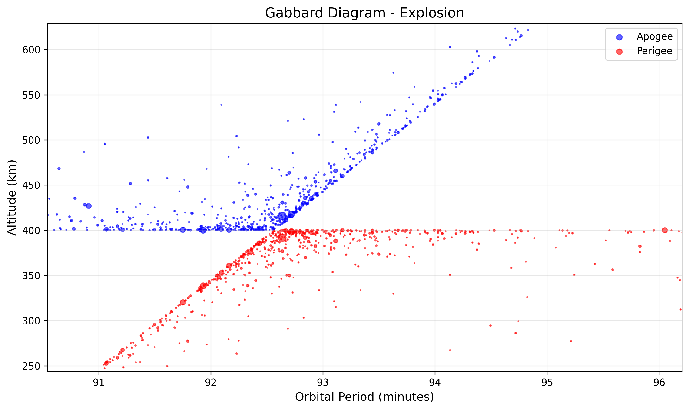
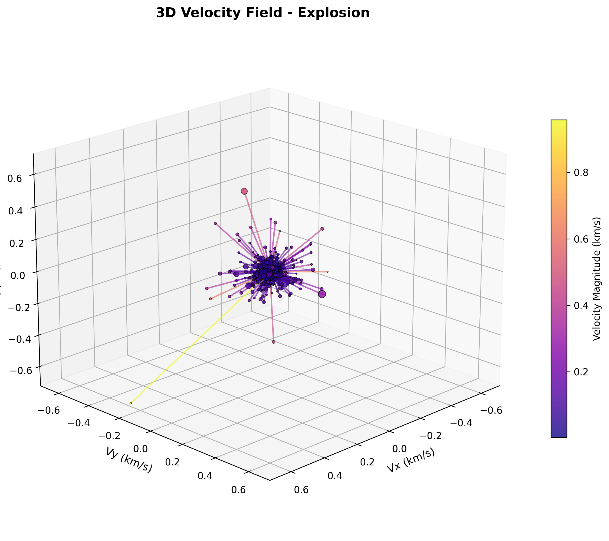
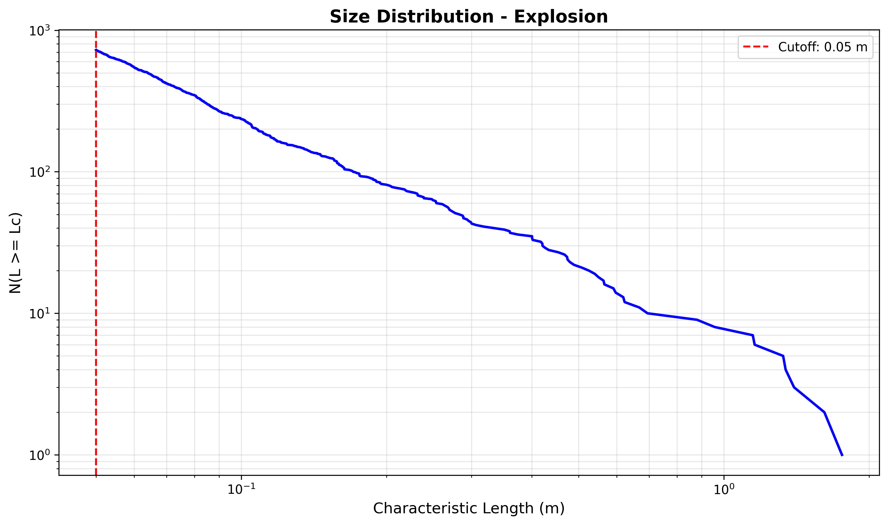

# nasa-sbm-py

Python library wrapping and extending the [ESA-validated C++ NASA Standard Breakup Model (SBM)](https://github.com/esa/NASA-breakup-model-cpp.git).

## Overview

`nasa-sbm-py` provides Python bindings to the ESA implementation of NASA Standard Breakup Model, a validated physics-based model for predicting debris from satellite explosions and collisions. This library wraps the C++ implementation with a modern Python interface using **xarray** for structured data handling and **NetCDF** for data persistence.

## Installation

### Prerequisites
- Python >= 3.8
- CMake >= 3.15
- C++17 compatible compiler
- pybind11 >= 2.10.0

### From source

```bash
git clone https://github.com/pingponghero12/nasa-sbm-py.git
cd nasa-sbm-py
git submodule update --init --recursive

pip install .
```

### Development installation

```bash
pip install -e ".[dev]"
```

## Usage
### Basic Explosion Simulation

```python
from nasa_sbm import explosion

# Simulate rocket body explosion at 400 km altitude
fragments = explosion(
    mass=839.0,                    # Parent mass in kg
    sat_type="rocket_body",        # Type:  "spacecraft" or "rocket_body"
    cutoff=0.05,                   # Minimum fragment size in meters
    seed=42,                       # Random seed for reproducibility
    orbit_altitude=400.0           # Orbit altitude in km
)

# Access fragment properties
print(f"Generated {len(fragments.fragment)} fragments")
print(f"Total mass: {fragments.fragment_mass.sum().values:.2f} kg")
print(f"Size range: {fragments.fragment_size. min().values:.4f} - {fragments.fragment_size.max().values:.2f} m")

# Save to NetCDF file
fragments.to_netcdf("explosion_results.nc")
```

### Collision Simulation

```python
from nasa_sbm import collision

# Simulate hypervelocity collision
fragments = collision(
    mass1=560.0,                   # First satellite mass in kg
    mass2=950.0,                   # Second satellite mass in kg
    velocity_relative=11.7,        # Relative velocity in km/s
    sat_type1="spacecraft",
    sat_type2="spacecraft",
    cutoff=0.05,
    seed=42,
    orbit_altitude=400.0
)

fragments.to_netcdf("collision_results.nc")
```

### Data Structure

Results are returned as xarray Datasets with the following structure: 

```python
<xarray.Dataset>
Dimensions:
  fragment:  N              # Number of fragments
  xyz: 3                   # Spatial dimensions

Data variables:
  fragment_size            # Characteristic length (m)
  fragment_mass            # Mass (kg)
  area_to_mass_ratio       # A/M ratio (m²/kg)
  cross_sectional_area     # Cross-sectional area (m²)
  delta_velocity           # Ejection velocity (km/s)
  parent_velocity          # Parent orbit velocity (km/s)
  initial_position         # Fragment positions (km)

Attributes:
  simulation_type          # "explosion" or "collision"
  parent_mass_kg           # Parent satellite mass
  satellite_type           # Satellite type
  size_cutoff_m            # Minimum fragment size
  n_fragments              # Fragment count
  orbit_altitude_km        # Orbital altitude
```

### Visualization

```python
from nasa_sbm. visualization import (
    plot_gabbard_diagram,
    plot_velocity_field_3d,
    plot_size_distribution, visualize_all
)

# Load results from file
import xarray as xr
fragments = xr.open_dataset("explosion_results.nc")

# Gabbard diagram (requires poliastro)
plot_gabbard_diagram(fragments, show=True)

# 3D velocity field
plot_velocity_field_3d(fragments, max_fragments=500, show=True)

# Size distribution
plot_size_distribution(fragments, show=True)

# Generate all plots
figs = visualize_all(fragments, output_dir="plots", show=False)
```





### Working with NetCDF Files

```python
import xarray as xr

# Load simulation results
fragments = xr.open_dataset("explosion_results.nc")

# Filter fragments by size
large_fragments = fragments.where(fragments.fragment_size > 0.1, drop=True)

# Extract velocity magnitudes
import numpy as np
v_magnitudes = np.linalg.norm(fragments.delta_velocity.values, axis=1)

# Export to other formats
df = fragments.to_dataframe()
df. to_csv("fragments.csv")
```

## Testing

```bash
# Run tests
pytest

# With coverage
pytest --cov=nasa_sbm --cov-report=term-missing
```

## License

GPL-3.0 - See LICENSE file for details

## References

- [NASA Standard Breakup Model of EVOLVE 4.0](https://www.sciencedirect.com/science/article/abs/pii/S0273117701004239)
- [Thesis on ESA C++ Implementation](https://mediatum.ub.tum.de/1624604)

## Acknowledgments

Built on top of ESA C++ implementation of the NASA Standard Breakup Model. 
